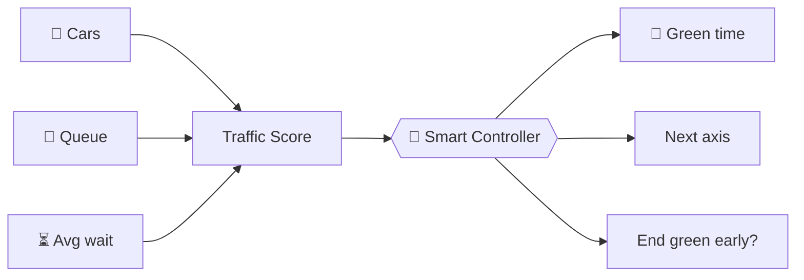
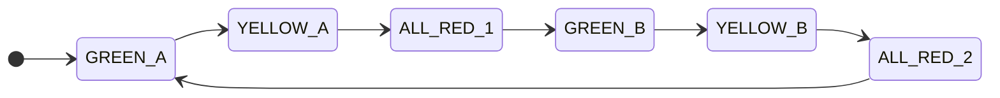
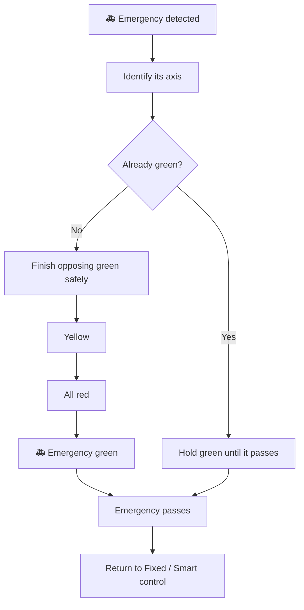
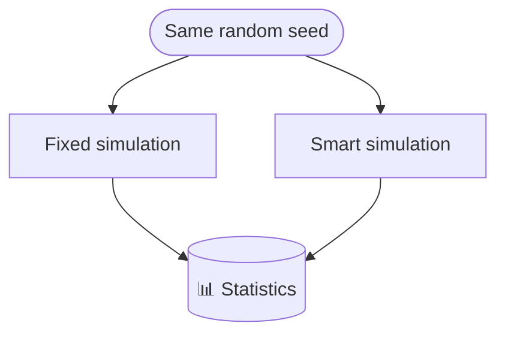
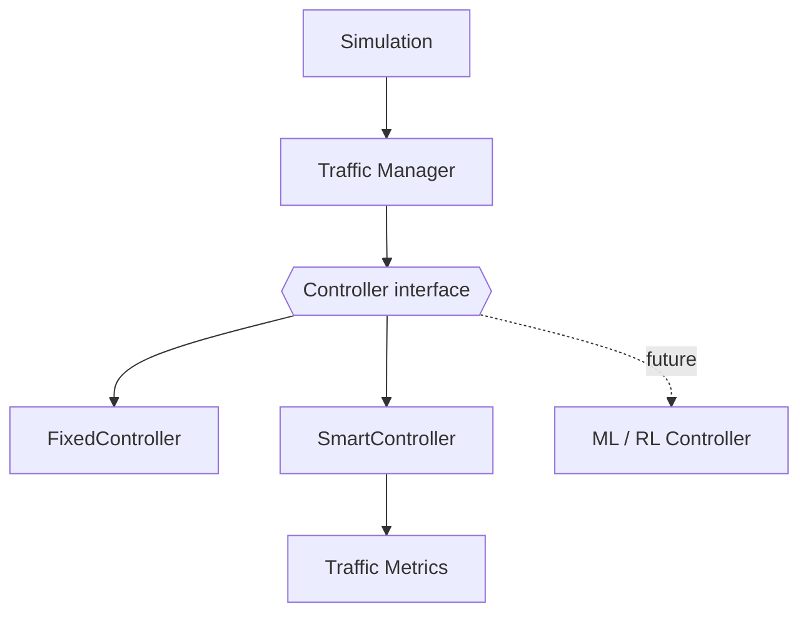

<div align="center">

# 🚦 Smart Traffic Light Intersection

**An adaptive traffic-signal simulator with emergency priority and reproducible Fixed-vs-Smart benchmarking.**

Built with Python and Pygame. Designed so the "brain" can be swapped for ML/RL without touching the simulation.

<br>


<br>


<sub>Add your best screenshot or GIF at <code>assets/simulation.png</code></sub>

<br><br>

[Features](#-features) ·
[Quick Start](#-quick-start) ·
[Controls](#-controls) ·
[How It Works](#-how-it-works) ·
[Architecture](#-architecture) ·
[Roadmap](#-roadmap)

</div>

---

## 📌 Overview

Fixed-timer traffic lights ignore reality: one road can be jammed while the other is empty. This project shows what happens when the signal **reacts** to traffic instead.

A **Smart Controller** measures cars, queue length and waiting time on each axis, then decides how long the next green should last and when to end the current one early. You can watch it live, switch back to fixed timing, or run a **headless benchmark** where both controllers face the *exact same* traffic.

| | Fixed Mode | Smart Mode |
|---|---|---|
| Green duration | Constant | Computed from live traffic |
| Reacts to empty roads | ✗ | ✓ ends green early |
| Starvation protection | ✗ | ✓ |
| Emergency priority | ✓ | ✓ |

---

## ✨ Features

<table>
<tr>
<td width="50%" valign="top">

### 🧠 Control
- **Fixed** and **Smart** adaptive modes
- Traffic score from cars, queue and wait
- Starvation guard against long waits
- Emergency vehicle priority

</td>
<td width="50%" valign="top">

### 🚗 Simulation
- Acceleration, braking, safe following distance
- Vehicles never cross a red light
- Yellow logic: stop if safe, otherwise proceed
- Backlog tracking for cars waiting off-map

</td>
</tr>
<tr>
<td valign="top">

### 📊 Analysis
- Live statistics dashboard
- Headless Fixed vs Smart comparison
- Same random seed, reproducible results

</td>
<td valign="top">

### 🎮 Interaction
- Four traffic densities
- Five time modes (Auto, Night, Normal, AM/PM Rush)
- Speed control from 0.5× to 10×
- Everything controllable from the keyboard

</td>
</tr>
</table>

---

## 🚀 Quick Start

```bash
# 1. Clone
git clone https://github.com/YOUR_USERNAME/smart-traffic.git
cd smart-traffic

# 2. Install
pip install -r requirements.txt

# 3. Run
python main.py
```

> [!NOTE]
> Requires **Python 3.11+** and **Pygame 2.x** on Windows or Linux. No GPU needed.

### 🧪 Suggested first session

1. Press `4` for **VERY HIGH** traffic and run in **Fixed** mode (`F`). Watch the queues grow.
2. Press `S` to switch to **Smart** mode and watch green times adapt.
3. Press `E` to spawn an emergency vehicle and watch the priority sequence.
4. Press `C` to run the **Fixed vs Smart** comparison.

---

## 🎮 Controls

<table>
<tr>
<td valign="top">

**Simulation**

| Key | Action |
|:--:|---|
| `F` | Fixed mode |
| `S` | Smart mode |
| `SPACE` | Pause / resume |
| `R` | Reset |
| `C` | Run comparison |

</td>
<td valign="top">

**Traffic**

| Key | Action |
|:--:|---|
| `1` | 🟢 Low |
| `2` | 🟡 Medium |
| `3` | 🟠 High |
| `4` | 🔴 Very high |
| `T` | Cycle time mode |
| `E` | Spawn emergency vehicle |

</td>
</tr>
</table>

**Speed:** `0.5×` · `1×` · `2×` · `5×` · `10×` (dashboard buttons)

**Time modes:** `AUTO → NIGHT → NORMAL → AM RUSH → PM RUSH → AUTO`

---

## 🧠 How It Works

### Smart green time

$$
\text{Green} = \mathrm{clamp}\Big(15 + 2 \times \text{cars} + 0.2 \times \text{avg\_wait},\ \text{MIN\_GREEN},\ \text{MAX\_GREEN}\Big)
$$

- More cars → longer green
- Longer waits → longer green
- Empty road → green can end early
- Excessive wait on the other axis → starvation protection kicks in

### Traffic score

$$
\text{Score} = \text{cars} + 1.5 \times \text{queue} + 0.2 \times \text{avg\_wait}
$$

Queued cars weigh more than moving ones because they represent traffic that is already blocked.



### Signal state machine

Directions never jump straight from green to green.



### Vehicle behaviour

Each car decides its target speed from its speed, the gap to the car ahead, and the signal ahead. The safe-stop rule is:

$$
\frac{v^2}{2a} \le d
$$

If the car can stop before the stop line (`d`), it does. If not, it continues through the yellow. This removes unrealistic instant braking.

### 🚑 Emergency priority



Supported types: 🚑 Ambulance · 🚒 Fire truck · 🚓 Police

---

## 📈 Fixed vs Smart benchmark

Press `C` to run both controllers **headless** on identical, seeded traffic.



Because both runs see the same generated cars, differences come from the controller, not from luck.

| Metric | What it tells you |
|---|---|
| Average / max waiting time | Fairness and comfort |
| Queue size | Congestion |
| Throughput | Vehicles cleared |
| Backlog | Demand the intersection could not absorb |
| Duration | Length of the test |

---

## 🏗️ Architecture

> **Design rule:** keep the simulation independent from the intelligence controlling it.
> `Simulation ≠ AI ≠ UI`

```text
smart_traffic/
├── config.py
├── main.py
├── requirements.txt
│
├── simulation/          # What happens?
│   ├── car.py
│   ├── traffic_light.py
│   ├── intersection.py
│   ├── traffic_manager.py
│   ├── statistics.py
│   ├── simulation.py
│   └── comparison.py
│
├── ai/                  # What should the light do?
│   ├── traffic_controller.py
│   ├── traffic_score.py
│   └── priority_system.py
│
└── ui/                  # How does the user see it?
    ├── renderer.py
    └── dashboard.py
```

### Controller interface

```python
green_time(...)
should_end_green(...)
choose_next_axis(...)
```

Implement these three methods and you have a new controller.



---

## 🤖 Future: ML, RL and Computer Vision

<details>
<summary><b>Reinforcement-learning formulation</b></summary>

<br>

| | |
|---|---|
| **State** | Vehicle count, queue length, average wait, current signal, time since last switch, emergency present |
| **Action** | Keep green · Switch direction · Extend green |
| **Reward** | Lower wait, shorter queues, higher throughput, emergency priority |

Only the controller is replaced. The simulation stays unchanged.

</details>

<details>
<summary><b>Camera-based pipeline</b></summary>

<br>


Swapping the simulated traffic source for real camera data would turn this into a real-world prototype.

</details>

---

## 🛣️ Roadmap

**Done**
- [x] Intersection, vehicle movement, acceleration and braking
- [x] Safe stopping logic and yellow-light handling
- [x] Fixed and Smart controllers, traffic scoring
- [x] Emergency priority and backlog tracking
- [x] Statistics and headless Fixed vs Smart comparison
- [x] Interactive dashboard

**Next**
- [ ] Multiple lanes
- [ ] Left / right turns
- [ ] Pedestrian crossings
- [ ] Multiple intersections and network-wide control
- [ ] YOLO vehicle detection and real camera input
- [ ] Reinforcement-learning controller
- [ ] Real-time analytics dashboard

---

## 🤝 Contributing

Ideas and pull requests are welcome. A great first contribution is a new controller class that implements the [controller interface](#controller-interface) and beats `SmartController` in the `C` benchmark.

## 📜 License

Released under the **MIT License**. See [`LICENSE`](LICENSE).

<div align="center">
<br>

**🚦 Smart Traffic Light Intersection**

<sub>Built with Python · Pygame · AI-ready architecture</sub>

</div>
